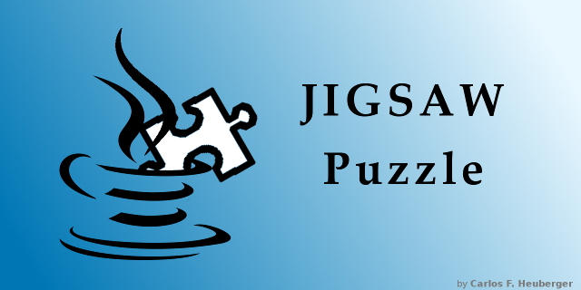

# Puzzle

My jigsaw puzzle

Work in progress.

*use at your own risk - no warranties!*

## Instructions

### Version

- append to JAR file in `docs/puzzle_V<version>.jar`
- `dist/puzzle.jar` ?
- adjust `jar` entry in `src/puzzle.jnlp`
  copy to `docs/`
- adjust `Implementation-Version` in `src/manifest.txt`
- adjust in `docs/index.md`

### Java Web Start

- `puzzle.jnlp` is available in `src/`
  copy to `docs/`

### Pictures

Originals are available under `src/pics/` as Gimp files.

- `icon.png`
  scaled to 32x32
  copy to `docs/` and `src/java/cfh/puzzle/resources`
- `splash.png`
  scaled to 640x320
  copy to `docs/` and `src/java/cfh/puzzle/resources`
- `social.png`
  used as Social Preview on GitHub

