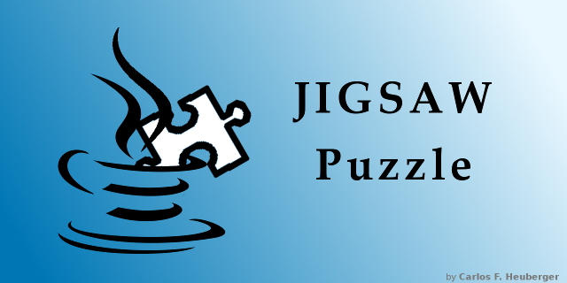

# Jigaw Puzzle Game

*use at your own risk - no warranties!*  v0.09

## Running

There are basically two ways to execute the game:

1. `Java Web Start` - a bit complicated but includes automatic updates, desktop shortcut
2. `local` - just no updates or desktop shortcut, but easy

### Java Web Start

Select:   [puzzle.jnlp](puzzle.jnlp) 

This should start the application, if Java Web Start is working correctly; 
otherwise the file is downloaded and must be started by double-click.

Java security needs the installation of 2 certificates to validate the download: if needed, download [here](https://cheuberger.github.io/keys/).

### Java (WIP)

Download the [ZIP file](https://github.com/Heuberger/Puzzle/releases/download/v0.09/Puzzle-0.09.zip) and extract its content. Start any of the included batch file (e.g. `bus.bat`) or just start (double-click) `puzzle.jar` (command line `java -jar puzzle.jar`).

## Requirements

Java 8 (`JRE8`) must be installed. Version `8u202` is recommended, license of newer versions have changed - please check it yourself! Old versions can be found at [Java Archive](https://www.oracle.com/java/technologies/javase/javase8-archive-downloads.html).

## How to Play

Open an image file to create a new puzzle
or
open a previously saved puzzle to continue playing.

*Note:* puzzles are **not saved** automatically!

#### Moving Pieces

* Use the `LEFT` button to drag and drop pieces. 
  If a piece is dropped near the correct neighbour(s), the pieces will snap together.
* Hold the `CTRL` Key and click on a connected piece to disconnect it.
* Use the scroll wheel or double-click (`LEFT` or `RIGHT` button) to rotate the piece(s) under the cursor.

#### General

* `RIGHT` click background to open menu.
* Use `LEFT` button on background to drag the whole surface.
* `CTRL`-digit or `CTRL`-letter to save current surface position under that key. 
  The corresponding digit or letter, without `CTRL`, to move to the corresponding saved position.
* `BACKSPACE` to move back to last position.

#### Marking

Marked (selected) pieces can be rearranged by selecting the `Arrange` menu point. If no pieces are marked and no selection group is active, all pieces will be rearranged. Connected pieces are never rearranged. The pieces will be arranged horizontally starting at the current location, or vertically if the `CTRL` key is pressed when the menu is selected.

* Pieces can be marked (selected) and unmarked by `SHIFT-LEFT`-clicking on them.
* Use `SHIFT-SPACE` to unmark all pieces.

#### Selection Group

Pieces can be grouped together in Selection Groups named by a digit or letter. Activating such group will mark the pieces of that group. While the group is active, marking/unmarking a piece will add/remove that piece from that group.

- `SHIFT`-digit or `SHIFT`-letter to activate Selection Group.
- `SHIFT`-`SPACE` to deactivate any group and unmark all pieces.
- `CTRL`-`SHIFT`-digit or `CTRL`-`SHIFT`-letter to save the actually marked pieces to a Selection Group.

#### Background

A background image can be loaded selecting the `Background` menu option. A color can be chosen instead of an image by entering `color` as file name.
